# LABTech WPF lecture

> A repo for a WPF lecture done for LABTECH Ltd. 2023-02.

## About Windows Desktop App development

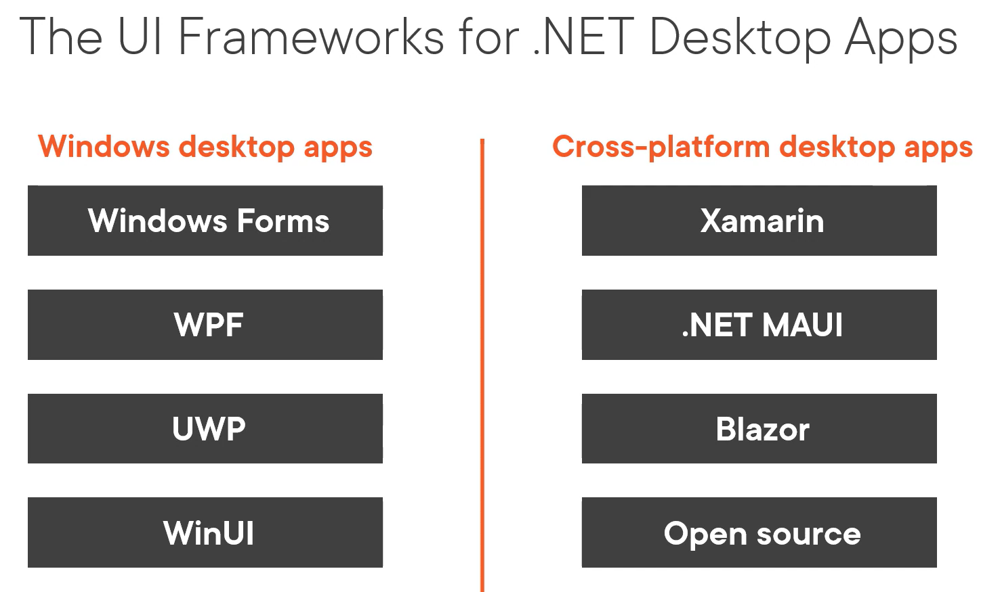

- XAML is used in WPF, UWP, WinUI, Xamarin.Forms, MAUI and others.
- Windows Forms (_WinForms_) use a form designer in Visual Studio.
- UWP (_WinForms_) should not be used for new apps.

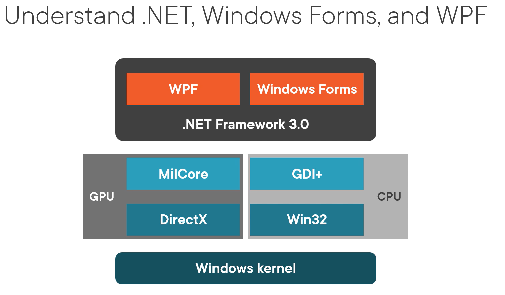

- WinForms have problems migrations to the latest .NET versions.
- WinForms are suitable for a small, forms-like application with short time span (_no ongoing development_).

### Windows 10/11 hosting model

- Two hosts Win32 & UWP.
- Win32 App can do whatever the app wants.
- UWP is a sandbox and it must declare in manifest what permissions requires.

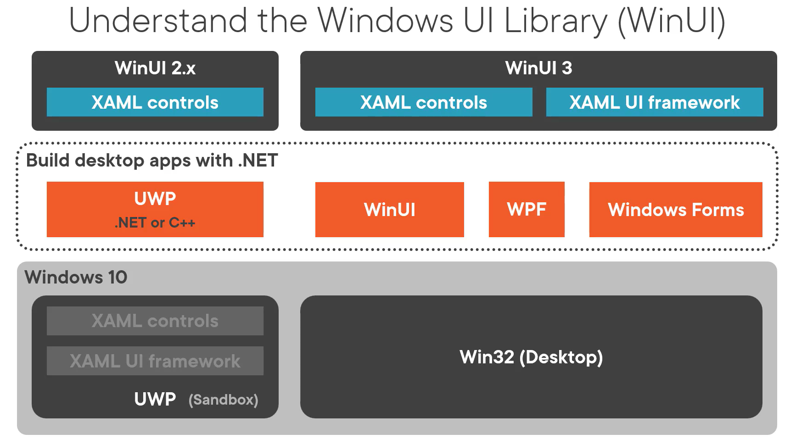

- UWP is tightly coupled to XAML controls and UI framework within Windows. You can't deploy a new app until you deploy a new version of Windows. Not usable model for business applications.
- WinUI 2.x uses NuGet for XAML controls decoupling part of UI from Windows.
- WinUI 3 decouples even UI framework from Windows 10 using NuGet.
- WinUI 3 uses Win32 hosting model.
- XAML UI Framework NuGet from WinUI 3 can't be used in UWP apps.
- UWP is not important anymore.
- UWP contains modern WinRT (_Windows RunTime API_) that can be called from WinUI, WPF & WinForm.

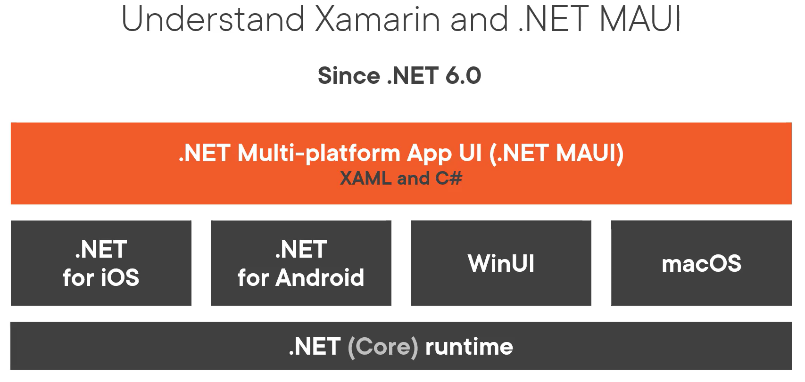

- Mono for Android -> Xamarin.Android -> .NET for Android.
- MonoTouch -> Xamarin.iOS -> .NET for iOS.
- Xamarin.Forms -> MAUI.
- MAUI is an abstraction platform to target different platforms.
- MAUI targets WinUI on Windows.

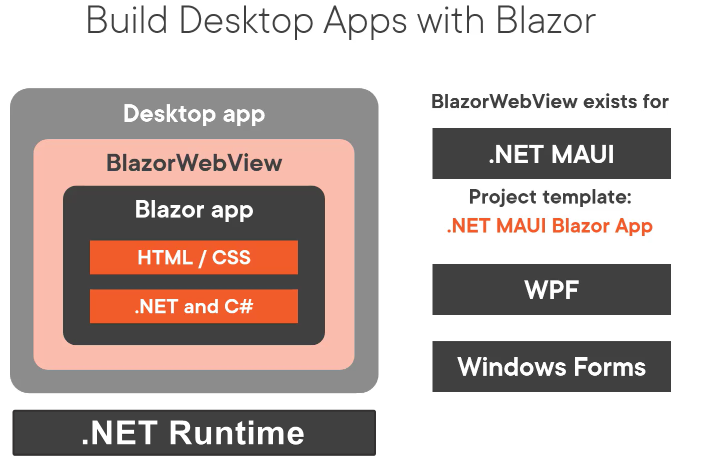

- Blazor desktop App is a relatively new, exotic approach to building of a desktop app.
- It is based on the containerized web application running in `BlazorWebView` on top of regular .NET desktop runtime (_instead of original WASM_).

## Non-Microsoft Open-Source options

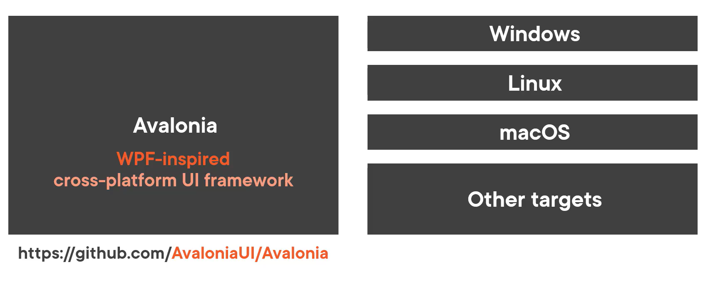
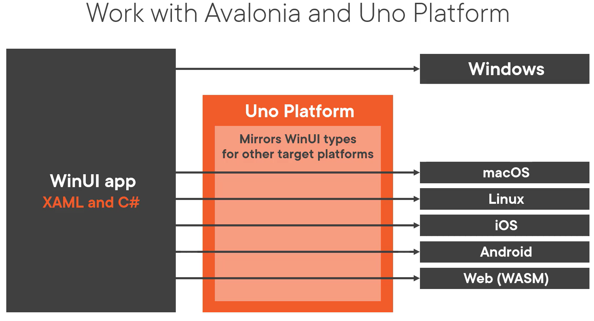

- Avalon was a code name for WPF.
- UNO is WinUI bridge.
- UNO is targets WinUI (_originally UWP Apps_) interfaces and mirrors WinUI types for other target platforms.
- In Avalonia, in Uno, a developer can use WPF, WinUI skills, respectively.

## How to choose?

- WinUI should be first choice on Windows 10/11.
- Windows => Is all required controls supported in WinUI? Yes => WinUI, WPF otherwise.
- Windows 7? => WPF
- Something else => MAUI, Avalonia, or Uno (_and brace  yourself for an impact_).

## About WPF

- A mature UI framework for desktop apps based on .NET, C# & XAML.
- In .NET since 2006.
- Open source, see https://github.com/dotnet/wpf
- XAML is E**X**tensible **A**pplication **M**arkup **L**anguage
- MVVM (_data binding_)
- Layouts
- Styles & Templates

## Solution structure

### MainWindow.xaml

- Initial generated Window in XAML.
- Should be processed as Page (Properties -> Build action)
- The instruction `x:Class=...` sets the corresponding class in code behind.

### App.xaml

- Definition of App itself.
- Build action Application Definition (_generates_ `Main(...)`)
- A link to initial window

### MainWindow.xaml.cs

- A code behind.
- A C# code associated with the corresponding XAML file.
- XAML generated code and a class generated are bind together with `partial`.

## Elements and attributes in XAML

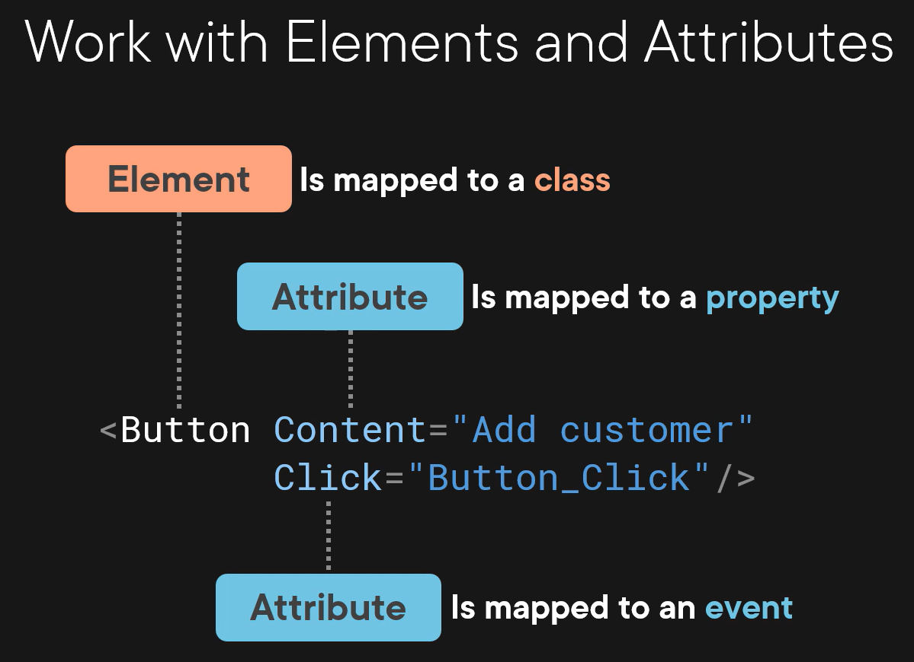

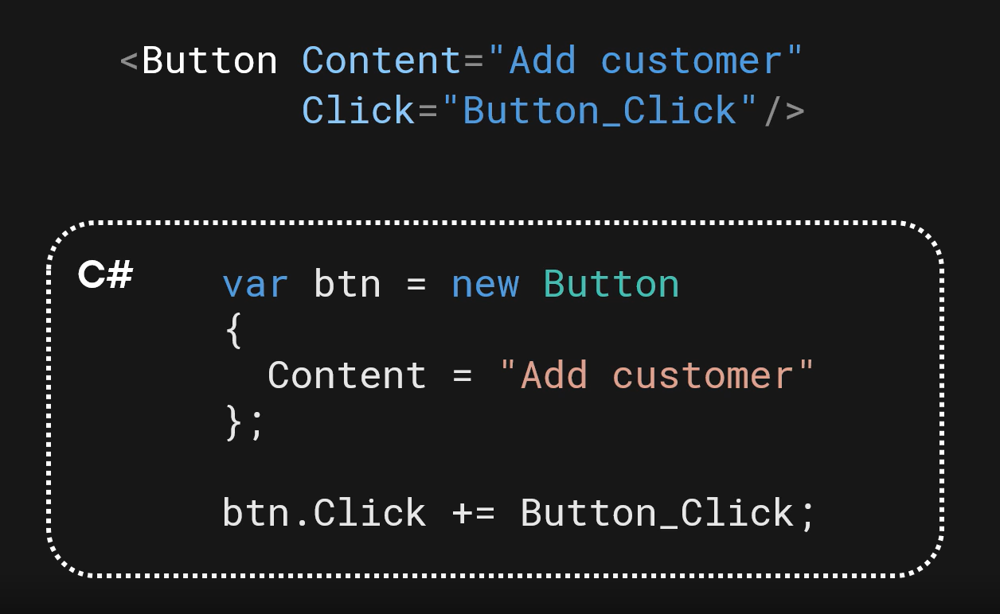

### Attribute element syntax

```xml
<Button Content="Add customer"
        x:Name="btnAddCustomer"
        HorizontalAlignment="Left"
        VerticalAlignment="Top"
        Margin="10"
        Click="ButtonAddCustomer_Click">
</Button>
```

The code `x:Name=...` is a special XAML attribute assignment taken from XAML XML definition (_see top of a window file_).

### Property element syntax

```xml
<Button x:Name="btnAddCustomer"
        HorizontalAlignment="Left"
        VerticalAlignment="Top"
        Margin="10" Width="75"
        Click="ButtonAddCustomer_Click">
    <Button.Content>
        <StackPanel Orientation="Horizontal">
            <Image Source="/Images/add.png" Height="18" Margin="0 0 5 0"/>
            <TextBlock Text="Add"/>
        </StackPanel>
    </Button.Content>
</Button>
```

The `<Button.Content>` doesn't have to be specified. It is the default property of the button. Most of the UI elements have the default property.

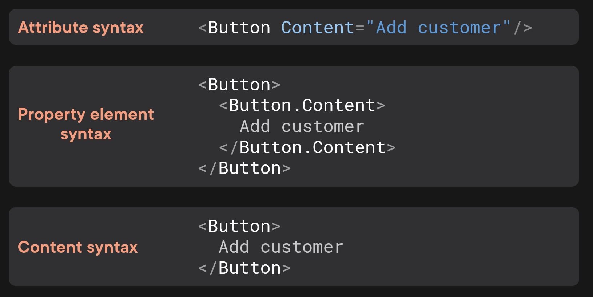

`Grid`, `StackPanel` have `Children` property of `UIElementCollection`type. We can assign multiple UI elements to them.

## StackPanel

- A basic panel used for stacking objects.


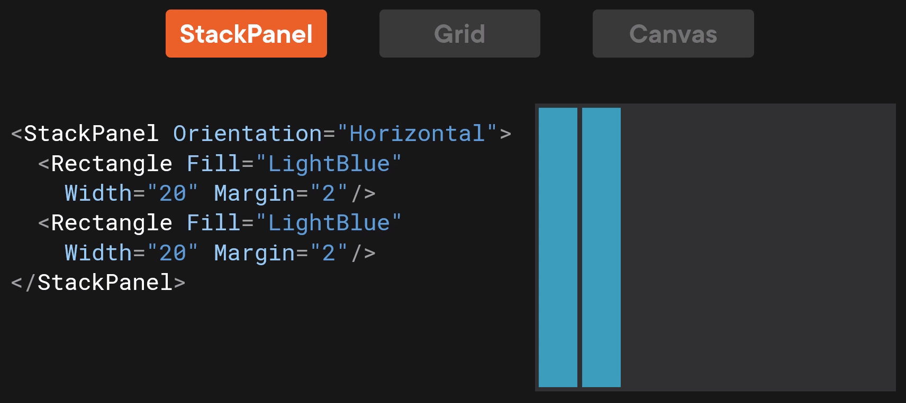

## Grid

- The most powerful panel in WPF.
- The most often used.

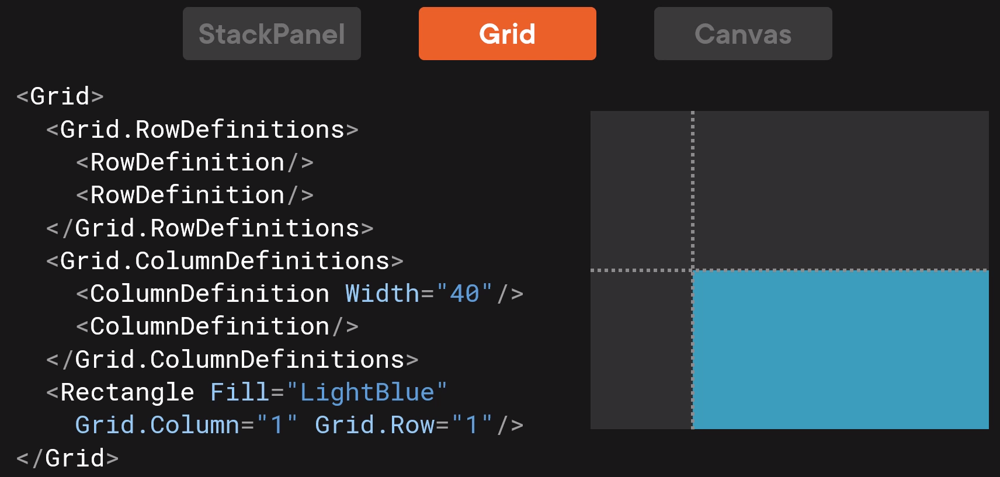

### Grid sizing

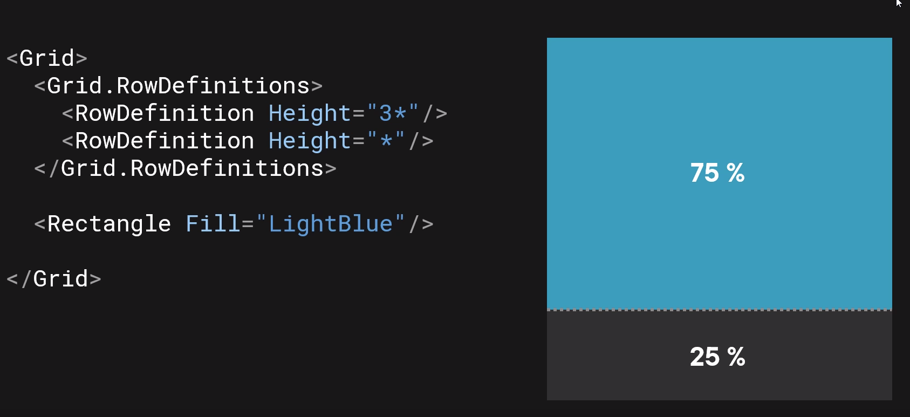
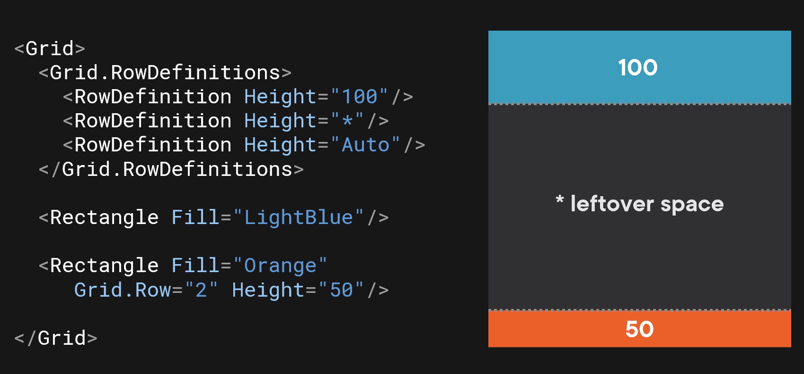

- Auto = equal to highest/widest element in row. If no element inside, 0 width/height.
- Star = auto size, a leftover space, the default value for rows, columns.

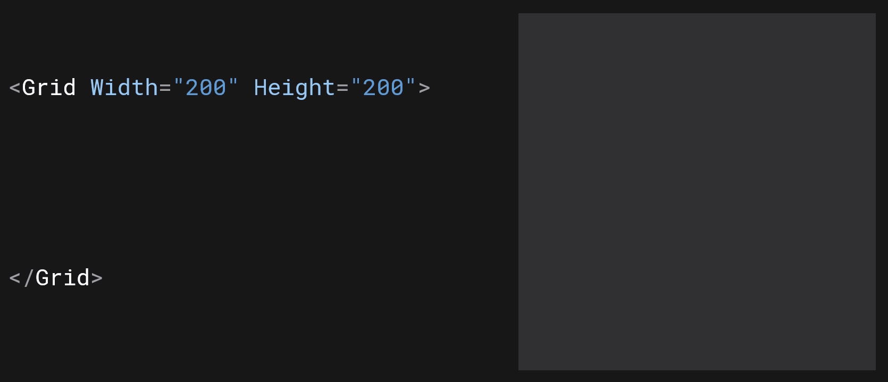

We can change the code in C#. We have to work with static Dependency properties, or (_better way_) static methods.

```csharp
private void ButtonMoveNavigation_Click(object sender, RoutedEventArgs e)
{
    //var column = (int)customerListGrid.GetValue(Grid.ColumnProperty);
    //var newColumn = column == 0 ? 2 : 0;
    //customerListGrid.SetValue(Grid.ColumnProperty, newColumn);

    var column = Grid.GetColumn(customerListGrid);
    var newColumn = column == 0 ? 2 : 0;
    Grid.SetColumn(customerListGrid, newColumn);
}
```

### Setting Grid properties to objects in a Grid

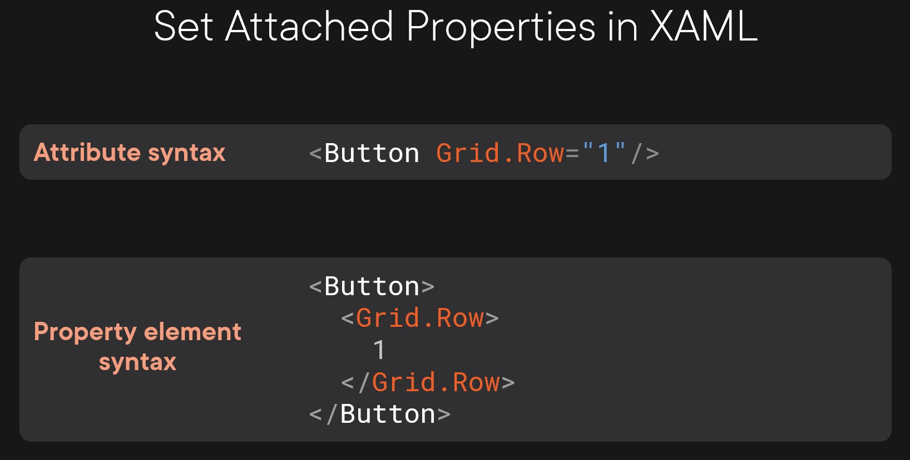

## Canvas

- Use of absolute positioning.
- Good for drawing rectangles, lines, ellipses for schemes.
- If not nested in Grid/StackPanel, it can't shrink.
- Objects are drawn in order of definition (_if not overridden_)


## Menu

- For building menus in our applications.
- Attribute `Header=_View` in `MenuItem` instructs to use a keyboard key `V` as a shortcut. Underscore is not visible.

```xml
<!-- Main menu -->
<Menu Grid.ColumnSpan="3" FontSize="20">
    <MenuItem Header="_View">
    <MenuItem Header="_Customers"/>
    <MenuItem Header="_Products"/>
    </MenuItem>
</Menu>
```

## User control

- Custom controls.
- Usually, saves parts of XAML syntax to a separate, reusable components.
- We have to add corresponding XML namespace instruction on top of our a window XAML file.

## XAML namespaces

- Brings assemblies to actual working space.
- `xmlns=".../2006/xaml/presentation/"` is the default namespace that is consisted from several assemblies decorated by `[assembly: XmlnsDefinitionAttribute("scheme", "assembly name")]`
- `xmlns:d="...blend/2008/"` is design namespace with attributes useful during design time.
- `mc:Ignorable="d"` says: Ignore namespace "d" in runtime.

## Data Binding

- Enables, e.g., coupling of element properties using marku extensions.
- Markup extension: a syntax in `{ }`
- 4 resources of binding source: Element, StaticResource, Relative resource and DataContext.
- `Text="{Binding ElementName=somethingNamedByX:NameAttribute, Path=NavigationProperty.SubProperty}"`
- `Text="{Binding Source={StaticResource someResource}}"`
- `Height="{Binding RelativeSource={RelativeSource Self}, Path=Width}"`
- Mode: OneWay, TwoWay, OneTime
- UpdateSourceTrigger: A trigger for a change.
- If `Path` is the first argument assigned, it can be omitted, `{Binding Path=Customers}` => `{Binding Customers}`.
- DataContext is our ViewModel, a place where we have data for UI and UI logic.

### How DataContext works

```xml
<Grid DataContext="LAB">
    <StackPanel>
        <TextBlock Text="{Binding}"/> <!--Set to LAB-->
    </StackPanel>
</Grid>
```

```xml
<Grid DataContext="LAB">
    <StackPanel DataContext="TECH">
        <TextBlock Text="{Binding}"/> <!--Set to TECH-->
    </StackPanel>
</Grid>
```

## MVVM

- Model-View-ViewModel
- Main design pattern used in WPF.
- View: `*.xaml` + `*.xaml.cs`
- Model: A business entity.
- ViewModel: Holds a state of model in UI.
- ViewModel is UI independent.
- This pattern increases Maintainability & Testability

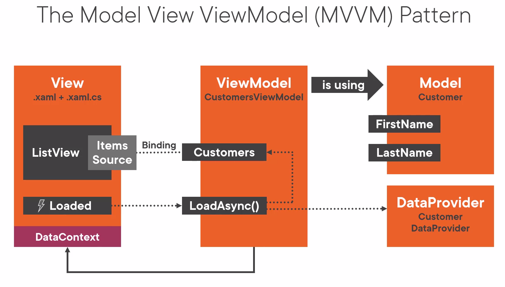

```csharp
public class ViewModelBase : INotifyPropertyChanged
{
    public event PropertyChangedEventHandler? PropertyChanged;

    protected virtual void RaisePropertyChanged([CallerMemberName] string? propertyName = null) => PropertyChanged?.Invoke(this, new PropertyChangedEventHandlerArgs(propertyName))
}
```

## IValueConverter

- Used for converting object in Data Binding.
- XAML Binding Failures window in Visual Studio.
- Converter must be a static resource.

```xml
<SomeUIElement.Resources>
    <converter:ClassNameOfTheConverter x:Key="ConverterNameInXAML"/>
</SomeUIElement.Resources>
<!-- Some XAML-->
<Grid Grid.Column="{Binding SomeValueFromViewModel, Converter={StaticResource ConverterNameInXAML}}">
```

### Default Visibility convertor

```xml
<Application.Resources>
    <BooleanToVisibilityConverter x:Key="BooleanToVisibilityConverter"/>
</Application.Resources>
<!-- Some XAML somewhere-->
<Grid Grid.Column="{Binding SomeBoolValueFromViewModel, Converter={StaticResource BooleanToVisibilityConverter}}">
```

## Command

- An implementation of `System.Windows.Input.ICommand` interface.
- More separation of UI logic from UIElements to view models.
- A replace for e.g., OnClick event handlers on buttons.
- Instead of button click event handlers, we can define data binding to view model properties of `ICommand`.
- DelegatedCommand: A command that executes some method.

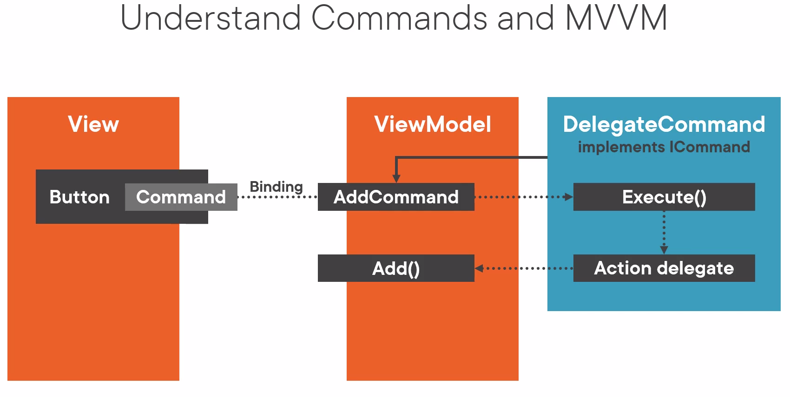

```csharp
public class DelegateCommand : ICommand
{
    private readonly Action<object?> _execute;
    private readonly Func<object?, bool>? _canExecute;

    public DelegateCommand(Action<object?> execute, Func<object?,bool>? canExecute = null)
    {
        ArgumentNullException.ThrowIfNull(execute);
        _execute = execute;
        _canExecute = canExecute;
    }

    public void RaiseCanExecuteChanged() => CanExecuteChanged?.Invoke(this, EventArgs.Empty);

    public event EventHandler? CanExecuteChanged;

    /// <Summary>
    /// The _canExecute is null when command can be executed every single time, so default value is null that case.
    /// </Summary>
    public bool CanExecute(object? parameter) => _canExecute is null || _canExecute(parameter);

    public void Execute(object? parameter) => _execute(parameter);
}
```

## Resources

- A dictionary of resources.
- Every resource needs a definition of `x:Key="SomeUniqueKey"`.
- Hierarchical structure, resources are searched upwards (_like_`DataContext`).
- Can be application wide.

```xml
<SomeUIElement.Resources>
    <SolidColorBrush x:Key="CompanyColor1" Color="#FFF000"/>
    <SolidColorBrush x:Key="CompanyColor2" Color="#000FFF"/>
</SomeUIElement.Resources>
```

```xml
<TextBlock Foreground="{StaticResource CompanyColor1}">
```

### Application wide

```xml
<Application.Resources>
    <SolidColorBrush x:Key="CompanyColor1" Color="#FFF000"/>
    <SolidColorBrush x:Key="CompanyColor2" Color="#000FFF"/>
</Application.Resources>
```

- Normally, we create `Resources` directory and organize the resources there based on type and destination.
- We create a WPF ResourceDictionary inside the `Resources` directory.
- We link those Resources to the App, a window, or a control.
- We need to merge multiple resource dictionaries.

```xml
<Application.Resources>
    <ResourceDictionary>
        <ResourceDictionary.MergedDictionaries>
            <ResourceDictionary = Source="/Resources/Brushes.xaml"/>
            <ResourceDictionary = Source="/Resources/Styles.xaml"/>
            <ResourceDictionary = Source="/Resources/Converters.xaml"/>
        </ResourceDictionary.MergedDictionaries>
    </ResourceDictionary>
</Application.Resources>
```

## Data Templates

- The class `ContentControl` defines property `Content` and `ContentTemplate`.
- `Content` accepts `object` (`System.Object`).
- Button, checkbox, window inherits from `ContentControl`.
- If `Content` is `UIElement`, it is rendered.
- If `Content` is something else, `ToString()` method is called. An arbitrary TextBlock UIElement is created behind the scene to display the string from `ToString()`.
- `DataTemplate` is used to control the output to UI. It is assigned to `ContentTemplate`.
- We bind a model to `Content`.
- `ItemsControl` has similar behavior. It defines `ItemsSource` and `ItemTemplate` to control the output of the items to UI.
- There implicit and explicit templates.
- Explicit templates defines `x:Key=""` attribute and they are assigned directly.

### Implicit data template

- A template assigned automatically based on target view model type.

```xml
<DataTemplate DataType="{x:Type viewModel:SomeViewModelClass}">
    <view: CustomersView/>
</DataTemplate>
```

## Dependency Injection

- We are solving complex dependency trees.
- DI is a form of Inversion of Control.
- Using DI follows Dependency Inversion Principle in order to have loosely coupled application.
- Using `Microsoft.Extensions.DependencyInjection` NuGet.

Simply, we want to avoid such code

```csharp
public MainWindow()
{
    InitializeComponent();
    _viewModel = new MainViewModel(
    new CustomersViewModel(new CustomerDataProvider()),
    new ProductsViewModel());
    DataContext = _viewModel;
    Loaded += MainWindow_Loaded;
}
```

- We configure services and generate a service provider in a constructor of `App.xaml.cs`.
- We push all dependencies to the Application class.
- We resolve dependencies there by the service provider.

## Styles

- Solves the problem of duplicate XAML code mostly related to styling.
- Solves the problem of style unification.
- Provides reusable XAML code.
- Styles can inherit form each other.
- There explicit & implicit styles.
- Explicit styles declares `x:Key="SomeUniqueKey"` attribute.
- Implicit styles declares +++++++only `TargetType="TextBox"`

```xml
<SomeUIElement.Resources>
    <Style TargetType="TextBox" x:Key="TextBoxDefaultStyle">
        <Setter Property="Background" Value="#555555">
        <Setter Property="Foreground" Value="White">
        <Setter Property="Padding" Value="5">
    </Style>
    <Style TargetType="TextBox" x:Key="TextBoxFancyStyle" BasedOn="{StaticResource TextBoxBaseStyle}">
        <Setter Property="Margin" Value="5">
    </Style>
</SomeUIElement.Resources>
<!--Some XAML code -->
<TextBox Style="{StaticResource TextBoxDefaultStyle}"/>
<TextBox Style="{StaticResource TextBoxDefaultStyle}" Foreground="Green"/> <!--Style property override-->
```

### Property Trigger style

- Used for, e.g., changing a style based on focus.
- `Trigger` checks a property value.
- `MultiTrigger` checks multiple property values.
- In multiple triggers targeting same property, the order of definition matters if multiple triggers are triggered.

```xml
<Style TargetType="TextBox" BasedOn="{StaticResource TextBoxBaseStyle}">
    <Style.Triggers>
        <Trigger Property="IsFocused" Value="True">
            <Setter Property="Background" Value="#111111"/>
        </Trigger>
    </Style.Triggers>
</Style>
```

## Custom control

- User controls have hard-coded XAML look.
- Custom controls are look less.
- Custom controls look is defined in a `ControlTemplate`.
- All WPF controls (_buttons, check boxes etc._) are custom controls.
- Default template can be defined by the `Template` property.
- By adjusting templates, we can modify properties that can't be modified directly.


## Input validation

- In Data Binding pipeline, we can validate in 4 different ways.
- By exceptions, `<TextBox Text="{Binding SomeProperty, ValidatesOnExceptions=True}"/>`
- By implementation of `IDataErrorInfo`, `<TextBox Text="{Binding SomeProperty, ValidatesOnDataErrors=True}"/>`
- By implementation of `INotifyDataErrorInfo`, no need to set anything, it is the default. Explicit set: `<TextBox Text="{Binding SomeProperty, ValidatesOnNotifyDataErrors=True}"/>`
- A custom validation rule to data binding validation properties. Other ways does this behind the scene.

### Example of generic `INotifyDataErrorInfo` implementation

```csharp
public class ValidationViewModelBase : ViewModelBase, INotifyDataErrorInfo
{
    private readonly Dictionary<string, List<string>> _errorsByPropertyName = new();

    public bool HasErrors => _errorsByPropertyName.Any();

    public event EventHandler<DataErrorsChangedEventArgs>? ErrorsChanged;

    public IEnumerable GetErrors(string? propertyName)
    {
        return propertyName is not null && _errorsByPropertyName.ContainsKey(propertyName)
        ? _errorsByPropertyName[propertyName]
        : Enumerable.Empty<string>();
    }

    protected virtual void OnErrorsChanged(DataErrorsChangedEventArgs e)
    {
        ErrorsChanged?.Invoke(this, e);
    }

    protected void AddError(string error, [CallerMemberName] string? propertyName = null)
    {
        if (propertyName is null) return;

        if (!_errorsByPropertyName.ContainsKey(propertyName))
        {
        _errorsByPropertyName[propertyName] = new List<string>();
        }
        if (!_errorsByPropertyName[propertyName].Contains(error))
        {
        _errorsByPropertyName[propertyName].Add(error);
        OnErrorsChanged(new DataErrorsChangedEventArgs(propertyName));
        RaisePropertyChanged(nameof(HasErrors));
        }
    }

    protected void ClearErrors([CallerMemberName] string? propertyName = null)
    {
        if (propertyName is null) return;

        if (_errorsByPropertyName.ContainsKey(propertyName))
        {
        _errorsByPropertyName.Remove(propertyName);
        OnErrorsChanged(new DataErrorsChangedEventArgs(propertyName));
        RaisePropertyChanged(nameof(HasErrors));
        }
    }
}
```

```xml

```

```csharp

```