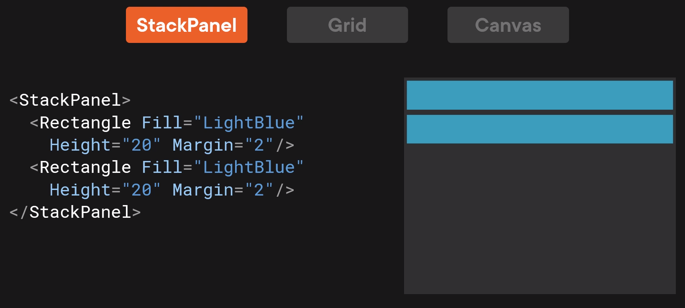

# LABTech WPF lecture

> A repo for a WPF lecture done for LABTECH Ltd. 2023-02.

## About WPF

- A mature UI framework for desktop apps based on .NET, C# & XAML.
- In .NET since 2006.
- Open source, see https://github.com/dotnet/wpf
- XAML is E**X**tensible **A**pplication **M**arkup **L**anguage
- MVVM (_data binding_)
- Layouts
- Styles & Templates

## Solution structure

### MainWindow.xaml

- Initial generated Window in XAML.
- Should be processed as Page (Properties -> Build action)
- The instruction `x:Class=...` sets the corresponding class in code behind.

### App.xaml

- Definition of App itself.
- Build action Application Definition (_generates_ `Main(...)`)
- A link to initial window

### MainWindow.xaml.cs

- A code behind.
- A C# code associated with the corresponding XAML file.
- XAML generated code and a class generated are bind together with `partial`.

## Elements and attributes in XAML


### Attribute element syntax

```xml
<Button Content="Add customer"
        x:Name="btnAddCustomer"
        HorizontalAlignment="Left"
        VerticalAlignment="Top"
        Margin="10"
        Click="ButtonAddCustomer_Click">
</Button>
```

The code `x:Name=...` is a special XAML attribute assignment taken from XAML XML definition (_see top of a window file_).

### Property element syntax

```xml
<Button x:Name="btnAddCustomer"
        HorizontalAlignment="Left"
        VerticalAlignment="Top"
        Margin="10" Width="75"
        Click="ButtonAddCustomer_Click">
    <Button.Content>
        <StackPanel Orientation="Horizontal">
            <Image Source="/Images/add.png" Height="18" Margin="0 0 5 0"/>
            <TextBlock Text="Add"/>
        </StackPanel>
    </Button.Content>
</Button>
```

The `<Button.Content>` doesn't have to be specified. It is the default property of the button. Most of the UI elements have the default property.


`Grid`, `StackPanel` have `Children` property of `UIElementCollection`type. We can assign multiple UI elements to them.

## StackPanel

- A basic panel used for stacking objects.




## Grid

- The most powerful panel in WPF.
- The most often used.


### Grid sizing


- Auto = equal to highest element in row
- Star = auto size, a leftover space, the default value for rows, columns.


## Canvas

- Use of absolute positioning.
- Good for drawing rectangles, lines, ellipses for schemes.
- If not nested in Grid/StackPanel, it can't shrink.
- Objects are drawn in order of definition (_if not overridden_)


## Menu

- For building menus in our applications.
- Attribute `Header=_View` in `MenuItem` instructs to use a keyboard key `V` as a shortcut. Underscore is not visible.

```xml
<!-- Main menu -->
<Menu Grid.ColumnSpan="3" FontSize="20">
    <MenuItem Header="_View">
    <MenuItem Header="_Customers"/>
    <MenuItem Header="_Products"/>
    </MenuItem>
</Menu>
```
